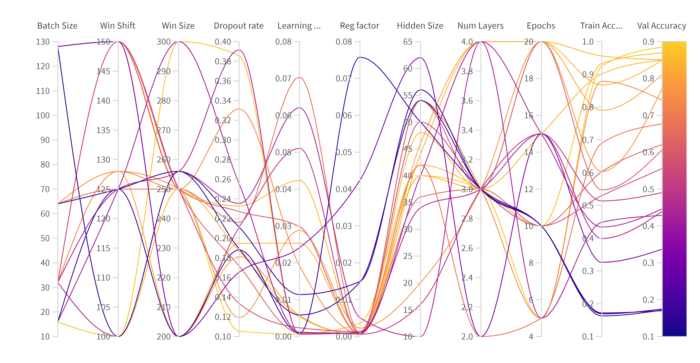
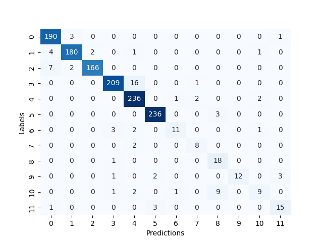

# Human-Activity-Recognition
Prediction of the movement of a person based on sensor data.

# How to run the code
Before running the script, make sure the requirements are met by installing from requirements.txt using  
```pip install -r requirements.txt```
1. Configure the config.gin file in /config

2. Use one of the following commands to perform training/evaluation. Make sure training is performed before evaluation or visualization. The experiment name which is used for training should be used for evaluation and visualization.

**Note**: Information on using checkpoints for evaluation can be found in the config file.

#### Train
```python main.py --train True --dir_name "Experiment-name"```

#### Evaluate
```python main.py --eval True --dir_name "Experiment-name"```

3. The files related to the experiment can be found under **/experiments/Experiment-name/version_0**.

## Directory structure
```
|-- Human_Activity_Recognition
    |-- .gitignore
    |-- README.md
    |-- requirements.txt
    |-- datasets
    |-- experiments
    |-- main.py
    |-- train.py
    |-- wandb-tune.py
    |-- architecture
    |   |-- base_model.py
    |   |-- models.py
    |-- configs
    |   |-- config.gin
    |-- input_pipeline
    |   |-- data_loader.py
    |-- utils
        |-- utils_misc.py
        |-- utils_params.py
```

* **Hyperparameter Tuning:**
<p align="center">
	  
</p>

Best Parameters for each model based on hyperparameter tuning

| Hyperparameters | Simple LSTM | Bidirectional LSTM | MaxPool LSTM | MaxPool Bidirectional LSTM |
| ------------- | ------------- | ------------- | ------------- | ------------- |
| Batch size | 128 | 64 | 32 | 64 |
| Window size | 200  | 256 | 200 | 256 |
| Window shift | 125 | 128 | 125 | 128 |
| Dropout rate | 0.3 | 0.16 | 0.3 | 0.1 |
| Learning rate | 0.004 | 0.003 | 0.001 | 0.003 |
| Regularization rate | 0.001 | 0.001 | 0.00045 | 0.001 |
| Number of LSTM layers | 2 | 2 | 3 | 3 |
| Hidden size | 26 | 60 | 42 | 50 |
| Epochs | 49 | 52 | 25 | 5 |

* **Evaluation Accuracy:**

	| Model | Evaluation accuracy |
	| ------------- | ------------- |
	| Simple LSTM | 92.7 |
	| Bidirectional LSTM | 93.79 |
	| MaxPool LSTM | 93.86 |
	| MaxPool Bidirectional LSTM | 94.3 |
	

* **Confusion Matrix: Maxpool Bidirectional LSTM**
<p align="center">
	  
</p>

